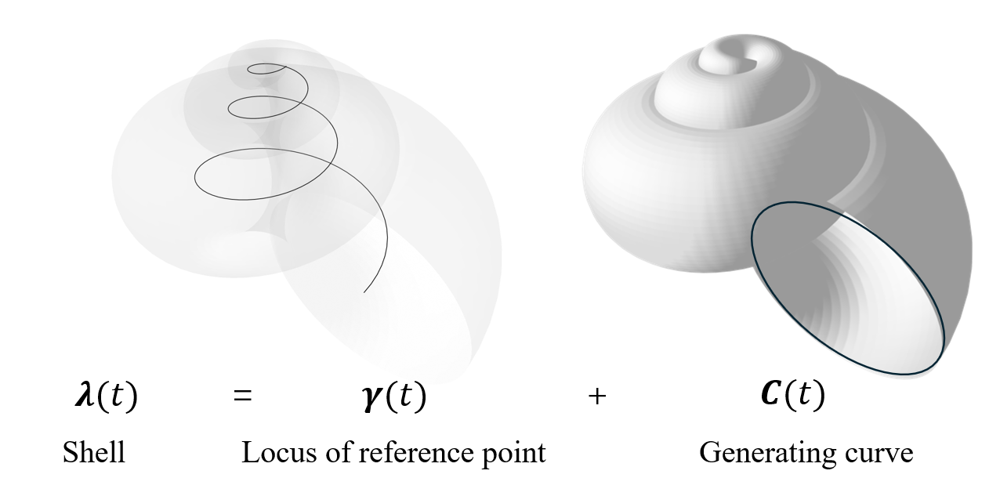
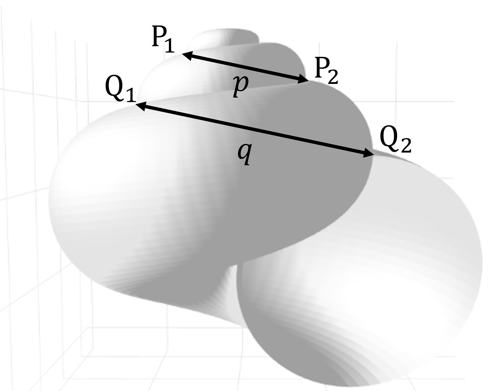
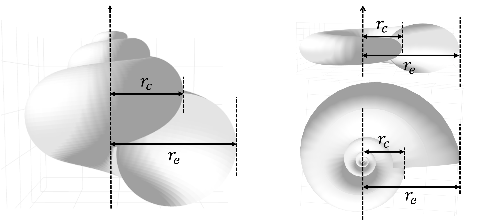
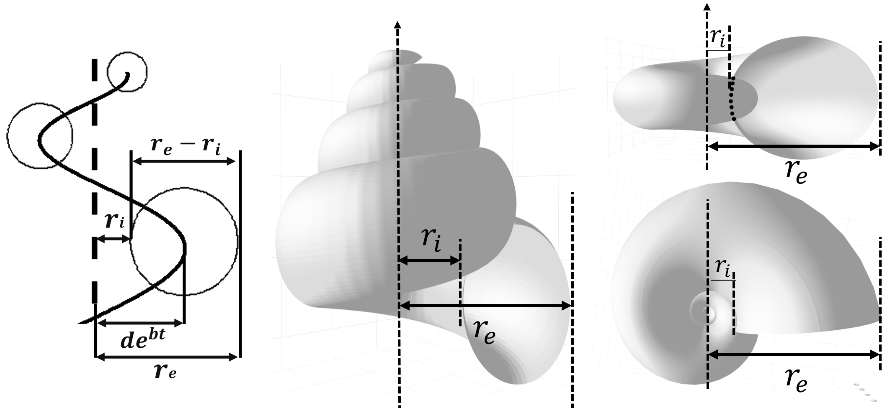
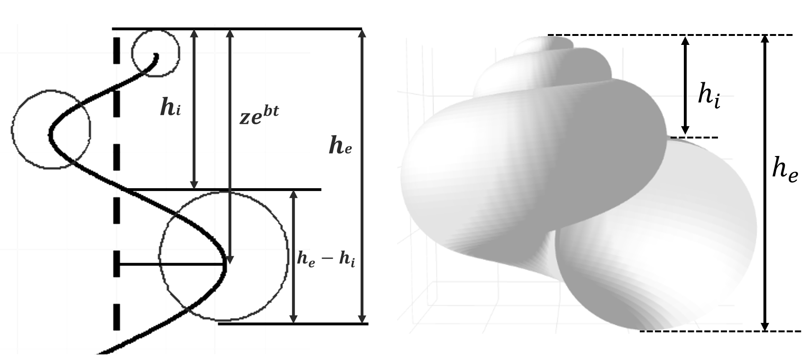
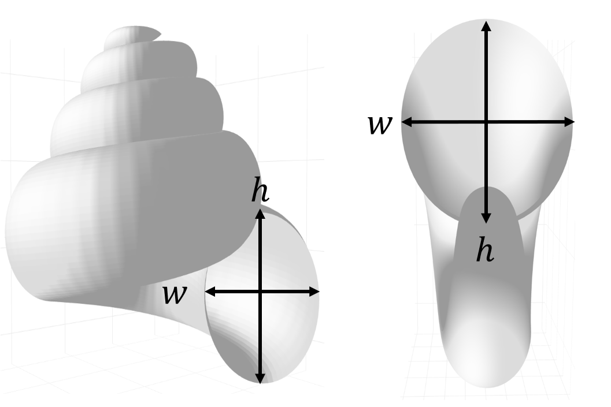
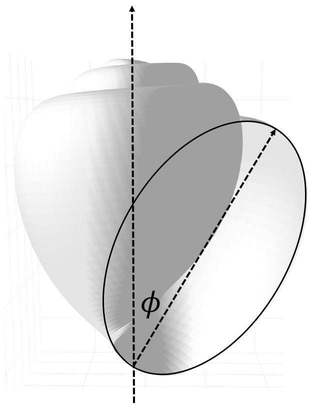

# Theoretical background of molluscs shell modelling

Ziyue XU

"How can it be that mathematics, being after all a product of human thought independent of experience, is so admirably adapted to the objects of reality? Is human reason, then, without experience, merely by taking thought, able to fathom the properties of real things?"  

—— Albert Einstein

## 1. Model

### 1.1. Basic Framework
For a conch (gastropod or cephalopod shell), its geometric morphology consists of two essential elements. First, the **locus of reference point**, which is the logarithmic spiral corresponding to the trajectory of the reference point; second, the **generating curve**, which defines the shape of the aperture, typically based on an ellipse. Therefore, the model can be expressed as:

$$
\boldsymbol{\lambda}(t) = \boldsymbol{\gamma}(t) + \boldsymbol{C}(t)\tag{1}
$$

where $\boldsymbol{\gamma}(t)$ is the logarithmic spiral rotating around the z-axis, and $\boldsymbol{C}(t)$ is the generating curve.

  

### 1.2. Locus of the Reference Point
$\boldsymbol{\gamma}(t)$ can be written as:

$$
\boldsymbol{\gamma}(t) = e^{bt} \begin{pmatrix} d \sin t \\ d \cos t \\ z \end{pmatrix}\tag{2}
$$

Here, $b$ is the expansion rate of the logarithmic spiral corresponding to the reference point trajectory, $d$ is the horizontal distance from the rotation axis (z-axis), and $z$ is the vertical distance of the growth point trajectory from the x-y plane. Next, we compute the Frenet–Serret frame of $\boldsymbol{\gamma}(t)$:

First, the unit tangent vector $\boldsymbol{\xi_1}$:

$$
\boldsymbol{\xi_1}(t)= \frac{\dot{\boldsymbol{\gamma}}(t)}{\|\dot{\boldsymbol{\gamma}}(t)\|}=
\frac{1}{\sqrt{(b^2+1)d^2+b^2z^2}}
\begin{pmatrix} d(b\sin t+\cos t) \\ d(b\cos t -\sin t ) \\ bz \end{pmatrix}\tag{3}
$$

Then the unit principal normal vector $\boldsymbol{\xi_2}$:

$$
\boldsymbol{\xi_2}(t)=\frac{\dot{\boldsymbol{\xi_1}}(t)}{\|\dot{\boldsymbol{\xi_1}}(t)\|}=
\frac{1}{\sqrt{b^2+1}}\begin{pmatrix} b\cos t -\sin t \\ -b\sin t -\cos t \\ 0 \end{pmatrix}\tag{4}
$$

Finally, the unit binormal vector $\boldsymbol{\xi_3}(t)$:

$$
\boldsymbol{\xi_3}(t)= \boldsymbol{\xi_1}(t)\times \boldsymbol{\xi_2}(t)=
\frac{1}{\sqrt{(b^2+1)((b^2+1)d^2+b^2z^2)}} \begin{pmatrix} bz(b\sin t+\cos t) \\ bz(b\cos t -\sin t ) \\ -d(b^2+1 ) \end{pmatrix}\tag{5}
$$

Thus, we obtain the Frenet–Serret frame of the logarithmic spiral (2): equations (3), (4), and (5).

### 1.3. Generating Curve
$\boldsymbol{C}(t)$ is the generating curve. When this closed curve moves along the vector function $\boldsymbol{\lambda}(t)$, it sweeps out the model surface of the mollusc shell. We start from the simplest case and gradually generalize the generating curve. Initially, we treat the generating curve as an ellipse with the basic parametric form:

$$
\begin{pmatrix} a\sin\theta \\ -\cos\theta \end{pmatrix}\tag{6}
$$

where $0\leq\theta<2\pi$, and $a$ is the ratio of the semi-major to semi-minor axis of the ellipse. If the ellipse is rotated by an angle $\phi$:

$$
\begin{pmatrix} \cos\phi & -\sin\phi \\ \sin\phi & \cos\phi \end{pmatrix}
\begin{pmatrix} a\sin\theta \\ -\cos\theta \end{pmatrix}=
\begin{pmatrix} a\sin\theta \cos\phi + \cos\theta \sin\phi \\ a\sin\theta\sin\phi - \cos\theta\cos\phi \end{pmatrix}\tag{7}
$$

The generating curve ellipse not only rotates by itself but also rotates around the normal vector $\boldsymbol{\xi_2}$ and binormal vector $\boldsymbol{\xi_3}$ of the current reference point trajectory. Therefore, it must be considered in three-dimensional space. It is not hard to imagine that the plane containing the generating curve $\boldsymbol{C}(t)$ is always perpendicular to the reference point trajectory $\boldsymbol{\gamma}(t)$. Hence, $\boldsymbol{C}(t)$ lies in the plane spanned by $\boldsymbol{\xi_2}(t)$ and $\boldsymbol{\xi_3}(t)$. Thus, the ellipse in $(7)$ can be expressed as:

$$
(a\sin\theta\cos\phi+\cos\theta\sin\phi)\boldsymbol{\xi_2}(t)+(a\sin\theta\sin\phi-\cos\theta\cos\phi)\boldsymbol{\xi_3}(t)\tag{8}
$$

Now, let $\delta$ denote the rotation angle around the $\boldsymbol{\xi_2}$ axis in the local moving coordinate system, and let $\psi$ denote the rotation angle around the $\boldsymbol{\xi_3}$ axis in the local moving coordinate system. Applying the rotation matrices $R_{\mathbf{\xi}_2}(\delta)$ and $R_{\mathbf{\xi}_3}(\psi)$ to equation $(8)$ yields:

$$
R_{\mathbf{\xi}_2}(\delta)\,R_{\mathbf{\xi}_3}(\psi) \left[\, (a\sin\theta\cos\phi+\cos\theta\sin\phi)\,\boldsymbol{\xi_2}(t)+(a\sin\theta\sin\phi-\cos\theta\cos\phi)\,\boldsymbol{\xi_3}(t)\, \right]\tag{9}
$$

Here, the rotation matrix $R_{\boldsymbol{\xi_2}}(\delta)$ is:

$$
R_{\xi_2}(\delta) = \begin{pmatrix}
\cos \delta & 0 & \sin \delta \\
0 & 1 & 0 \\
-\sin \delta & 0 & \cos \delta
\end{pmatrix}
$$

and $R_{\mathbf{\xi}_3}(\psi)$ is:

$$
R_{\mathbf{\xi}_3}(\psi) = 
\begin{pmatrix}
\cos \psi & -\sin \psi & 0 \\
\sin \psi & \cos \psi & 0 \\
0 & 0 & 1
\end{pmatrix}\tag{10}
$$

Furthermore, as the generating curve $\boldsymbol{C}(t)$ moves along the reference point trajectory $\boldsymbol{\gamma}(t)$, its radius naturally expands. According to practical experience and Raup's assumption, this increase is exponential rather than linear. Therefore, we use $e^{bt}$ to capture the expansion dynamics of the generating curve. However, we note that at $t=0$, the ellipse formed by the generating curve is not infinitesimally small, meaning the tip of the spiral is not closed, which contradicts reality. Thus, we modify it to $e^{bt}-\frac{1}{t+1}$, ensuring the tip is closed (if a specific spiral does not meet this assumption, simply adjust $t$ to an appropriate value as the initial condition). Therefore,

$$
\boldsymbol{C}(t,\theta)=(e^{bt}-\frac{1}{t+1})R_{\xi_2}(\delta)R_{\mathbf{\xi}_3}(\psi) \left[\, (a\sin\theta\cos\phi+\cos\theta\sin\phi)\,\boldsymbol{\xi_2}(t)+(a\sin\theta\sin\phi-\cos\theta\cos\phi)\,\boldsymbol{\xi_3}(t)\, \right]\tag{11}
$$

Consequently, we finally obtain the analytical expression for $(1)$ (though this expression is still relatively basic):

$$
\boldsymbol{\lambda}(t) = e^{bt} \begin{pmatrix}d \sin t\\d \cos t\\z\end{pmatrix}+(e^{bt}-\frac{1}{t+1})R_{\xi_2}(\delta)R_{\mathbf{\xi}_3}(\psi) \left[\, (a\sin\theta\cos\phi+\cos\theta\sin\phi)\,\boldsymbol{\xi_2}(t)+(a\sin\theta\sin\phi-\cos\theta\cos\phi)\,\boldsymbol{\xi_3}(t)\, \right]\tag{12}
$$

## 2. Parameters and Parameter Estimation

Parameter equation (12) contains seven dimensionless fixed parameters: $b, d, z, a, \phi, \delta, \psi$.

- $b$: Expansion rate. This parameter measures not only the expansion rate of the logarithmic spiral $\boldsymbol{\gamma}(t)$ for the reference point trajectory (see (2)), but also the expansion rate of the generating curve $\boldsymbol{C}(t, \theta)$ (see (11)). Range: $0 \leq b < \infty$.

- $d$: The perpendicular distance from the reference point trajectory $\boldsymbol{\gamma}(t)$ to the rotation axis. Range: \( 0 < d < \infty \).

- $z$: The vertical distance from the reference point trajectory $\boldsymbol{\gamma}(t)$ to the $x - y$ plane. Range: $ -\infty < z < \infty$; when $z > 0$, the spiral is dextral; when $z < 0$, the spiral is sinistral; when $z = 0$, the spiral is planar.

- $a$: The ratio of the major to minor axes of the elliptical generating curve. Range: $0 < a < \infty$. If $a < 1$, the aperture is narrow; if $a = 1$, the aperture is circular; if $a > 1$, the aperture is wide.

- $\phi$: The initial tilt angle of the elliptical generating curve. Range: $0 \leq \phi < \pi$; when $\theta = \pi$, the initial configuration is obtained.

- $\delta$: The rotation angle of the generating curve around the normal vector $\boldsymbol{\xi_2}$ at the current position of the reference point trajectory. Range: $-\frac{\pi}{2} \leq \delta < \frac{\pi}{2}$.

- $\psi$: The rotation angle around the $\boldsymbol{\xi_3}(t)$ axis. To avoid self-intersection, the considered range is: $0 \leq \psi < \frac{\pi}{2}$.

### 2.1. Estimation of Parameter $b$

#### 2.1.1. Gabriela’s Method

On the shell, select four points $\mathbf{P_1}, \mathbf{P_2}, \mathbf{Q_1}, \mathbf{Q_2}$ lying on the generating ellipse of the aperture (see figure).

From (1) $\boldsymbol{\lambda}(t, \theta) = \boldsymbol{\gamma}(t) + \boldsymbol{C}(t, \theta)$, and from (11):

$$
\boldsymbol{C}(t, \theta)\approx e^{bt} \cdot \mathbf{w}(t, \theta)
$$

where $\mathbf{w}(t,\theta)$ is periodic with period $2\pi$. Similarly,

$$
\boldsymbol{\gamma}(t) = e^{bt} \cdot \mathbf{v}(t)
$$

Thus,

$$
\boldsymbol{\lambda}(t, \theta) \approx e^{bt} \cdot \mathbf{u}(t,\theta)
$$

where $\mathbf{u}(t,\theta)$ is also $2\pi$-periodic.

Assume $\mathbf{P_1}$ is a point on the current whorl (near parameter $t$), $\mathbf{P_2}$ is separated by $\pi$, $\mathbf{Q_1}$ by another $\pi$, and $\mathbf{Q_2}$ by yet another $\pi$:

$$
\begin{cases}
\mathbf{P_1} \approx e^{bt} \mathbf{u}(t, \theta)\\
\mathbf{P_2} \approx e^{b(t +\pi)} \mathbf{u}(t+\pi,\theta)\\
\mathbf{Q_1} \approx e^{b(t + 2\pi)} \mathbf{u}(t,\theta) = e^{2\pi b} \mathbf{P_1} \\
\mathbf{Q_2} \approx e^{2\pi b} \mathbf{P_2}
\end{cases}\tag{13}
$$

Define:

$$
p=\|\mathbf{P_2}-\mathbf{P_1}\|\tag{14}
$$
$$
q=\|\mathbf{Q_2}-\mathbf{Q_1}\|\tag{15}
$$

Then:

$$
\frac{q}{p}=e^{2\pi b}\tag{16}
$$

Taking natural logarithm:

$$
b = \frac{\log q - \log p}{2\pi}\tag{17}
$$

then we have $b$.

  

#### 2.1.2. Raup’s Method

Alternatively, use Raup’s approach. The horizontal projection of (2):

$$
r_{x,y}(t)=de^{bt}\tag{19}
$$

In Raup’s model: $r_{x,y}(t)=r_0 W^{t/2\pi}$, so

$$
W=e^{2\pi b}\tag{20}
$$

$$
b=\frac{\log r_e - \log r_c}{2\pi}\tag{21}
$$

  

Gabriela’s method has limitations for planispiral shells, whereas Raup’s method is convenient for radial measurements. In practice, choose flexibly.

Both methods are essentially identical: due to self-similarity of the logarithmic spiral, any corresponding linear dimension ratio between successive whorls equals $e^{2\pi b}$.

### 2.2. Estimation of Parameter $d$

From (19): 
$$
d = \frac{r_{x,y}(t)}{e^{bt}}\tag{22}
$$

The distance $r_{x,y}(t)$ cannot be measured directly on the shell exterior, but the generating curve radius is $(r_e - r_i)/2$, so:

$$
r_{x,y}(t)=r_i + \frac{r_e-r_i}{2}\tag{23}
$$

  

For $e^{bt}$, the asymptotic generating curve radius (major axis direction) is $a e^{bt}$, so:

$$
e^{bt} = \frac{r_e - r_i}{2a}\tag{24}
$$

Thus:

$$
d = \frac{r_e + r_i}{r_e - r_i} a\tag{25}
$$

In real shells, $d$ and $a$ are linearly related (unlike the full theoretical morphospace).

### 2.3. Estimation of Parameter $z$

Similarly:

$$
z = \frac{r_z(t)}{e^{bt}}\tag{26}
$$

$$
r_z(t)=h_e + \frac{h_e-h_i}{2}\tag{27}
$$

Asymptotic minor axis radius → 
$$
e^{bt} = \frac{h_e - h_i}{2}\tag{28}
$$

Hence:

$$
z = \frac{h_e + h_i}{h_e - h_i}\tag{29}
$$

  

Valid only for shells with vertical translation ($z \neq 0$).

### 2.4. Estimation of Parameter $a$

Directly the aperture aspect ratio:

$$
a=\frac{w}{h}\tag{30}
$$

  

### 2.5. Estimation of Parameter $\phi$

Measure the angle between the z-axis and the vertical axis of the generating ellipse:

$$
\phi = \arccos\frac{\mathbf{v_1} \cdot \mathbf{v_2}}{\|\mathbf{v_1}\|\|\mathbf{v_2}\|}\tag{31}
$$

  

### 2.6. Estimation of Parameter $\psi$

Primarily used for bivalves or rotated apertures. Measure vectors $\mathbf{u_1}$ (from aperture midpoint to dorsal margin) and theoretical $\mathbf{u_2}$ (parallel to $\boldsymbol{\xi_2}$ when $\psi=0$):

$$
\psi = \arccos \frac{\mathbf{u_1} \cdot \mathbf{u_2}}{\|\mathbf{u_1}\|\|\mathbf{u_2}\|}\tag{32}
$$

## 3. Special Cases

### 3.1. Generating Curve Changing from Smooth to Oscillatory

For equation (11), let:
- $$ u(\theta) = a \sin \theta \cos \phi + \cos \theta \sin \phi $$
- $$ v(\theta) = a \sin \theta \sin \phi - \cos \theta \cos \phi $$

Temporarily ignoring the expansion with respect to $t$, and neglecting the linear transformation in the Frenet frame caused by the rotation matrix $R_{\boldsymbol{\xi}_3}(\psi)$, we have:

$$
\boldsymbol{C}_1(\theta) = u(\theta) \boldsymbol{\xi}_2 + v(\theta) \boldsymbol{\xi}_3 \tag{33}
$$

Introduce a perturbation term applied to both components:

$$
\boldsymbol{C}_2(\theta) = (1 + m_1 \sin(n_1 \theta)) \cdot [u(\theta) \boldsymbol{\xi}_2 + v(\theta) \boldsymbol{\xi}_3] \tag{34}
$$

where two parameters are involved: **\( m_1 \) is the oscillation amplitude, and \( n_1 \) is the oscillation frequency**.

Consider the polar representation of the original generating curve in the local plane:

$$
r(\theta) = \sqrt{u^2(\theta) + v^2(\theta)} = \sqrt{a^2 \sin^2 \theta + \cos^2 \theta} \tag{35}
$$

After perturbation:

$$
r'(\theta) = r(\theta) \cdot (1 + m_1 \sin(n_1 \theta)) \tag{36}
$$

- When $\sin(n_1 \theta) = 1$, $r'(\theta) = r(\theta) (1 + m_1)$: outward expansion.
- When $\sin(n_1 \theta) = -1$, $r'(\theta) = r(\theta) (1 - m_1)$: inward contraction.
- When $\sin(n_1 \theta) = 0$, $r'(\theta) = r(\theta)$: no change.

### 3.2. Oscillatory Radius of the Generating Curve

For equation (11), let:
- $u(\theta) = a \sin \theta \cos \phi + \cos \theta \sin \phi$
- $v(\theta) = a \sin \theta \sin \phi - \cos \theta \cos \phi$
- $s(t) = \left(e^{bt} - \frac{1}{t+1}\right)$

and again neglecting the linear transformation in the Frenet frame caused by the rotation matrix \( R_{\boldsymbol{\xi}_3}(\psi) \), we have:

$$
\boldsymbol{C}_3(\theta) = s(t) \cdot [u(\theta) \boldsymbol{\xi}_2 + v(\theta) \boldsymbol{\xi}_3] \tag{37}
$$

Applying an oscillatory factor yields:

$$
\boldsymbol{C}_4(\theta) = (1 + m_2 \sin(n_2 t)) \cdot s(t) \cdot [u(\theta) \boldsymbol{\xi}_2 + v(\theta) \boldsymbol{\xi}_3(t)] \tag{38}
$$

where two parameters are involved: **\( m_2 \) is the oscillation amplitude, and \( n_2 \) is the oscillation frequency**.

# Appendix 1: Curvature and Torsion

### Appendix 1.1. Curvature

$$
\kappa(t) = \frac{d \sqrt{b^2 + 1} \, e^{-bt}}{b^2(d^2 + z^2) + d^2}\tag{40}
$$

### Appendix 1.2. Torsion

$$
\tau(t) =  \frac{-b z \, e^{-bt}}{b^2(d^2 + z^2) + d^2}\tag{42}
$$

# Appendix 2: References

(1) Contreras-Figueroa, G., & Aragón, J. L. (2023). A mathematical model for mollusc shells based on parametric surfaces and the construction of theoretical morphospaces. Diversity, 15(3), 431.

(2) Noshita, K. (2014). Quantification and geometric analysis of coiling patterns in gastropod shells based on 3D and 2D image data. Journal of theoretical biology, 363, 93-104.

(3) Raup, D. M. (1966). Geometric analysis of shell coiling: general problems. Journal of paleontology, 1178-1190.

(4) Stone, J. R. (1996). The evolution of ideas: a phylogeny of shell models. The American Naturalist, 148(5), 904-929.

